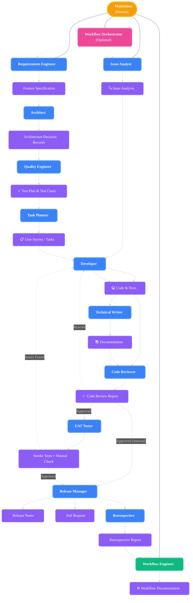

# Agent-Based Coding Workflow

This document describes the agent-based workflow for feature development in this project. The workflow is inspired by best practices from the GitHub Copilot agents article, the VS Code Copilot Custom Agents documentation, and modern software engineering principles.

Agents work locally and produce artifacts as markdown files in the repository. The **Maintainer** coordinates handoffs between agents by starting chat sessions with each agent in VS Code. Agents may ask the Maintainer for clarification or request that feedback be relayed to a previous agent.

---

## Entry Point

The workflow begins when the **Maintainer** identifies a need:

### Manual Coordination (Default)

- **New Feature**: Start with the **Requirements Engineer** agent to gather requirements and create a Feature Specification
- **Bug Fix / Incident**: Start with the **Issue Analyst** agent to investigate and document the issue
- **Workflow Improvement**: Start with the **Workflow Engineer** agent to modify the development process itself

Throughout the workflow, the Maintainer coordinates handoffs between agents and provides clarifications as needed.

### Automated Orchestration (Optional)

For well-defined features or bugs, use the **Workflow Orchestrator** agent to automate the complete workflow:

- **GitHub (Cloud) - RECOMMENDED**: Assign a GitHub issue to `@copilot` to trigger automated orchestration from issue to release. The orchestrator runs as a coding agent with full delegation capabilities via the `task` tool.
- **VS Code (Local) - LIMITED**: Use `@workflow-orchestrator` in chat for interactive orchestration. Note that full programmatic delegation is limited in VS Code context compared to GitHub.

**How It Works**:

- The orchestrator **never asks clarifying questions** - it immediately delegates to the appropriate entry point agent (Requirements Engineer for features, Issue Analyst for bugs)
- The orchestrator **never implements anything itself** - it purely delegates to specialized agents in sequence
- Entry point agents (Requirements Engineer, Issue Analyst) handle requirements gathering and ask any needed clarifying questions
- The orchestrator tracks progress and handles feedback loops (code review rework, UAT failures)

**Best for**:

- Complete feature implementations with clear issue descriptions
- Bug fixes needing full workflow (investigation → fix → release)
- Reducing cognitive load on routine development tasks
- GitHub issue-driven development

**Not suitable for**:

- Exploratory analysis or design work (use individual agents directly)
- Single-agent tasks (just use that agent)
- Highly interactive work requiring maintainer decisions at each step

**Verification note:** If a change only touches agent instructions / skills / documentation (for example `.github/agents/`, `.github/skills/`, `.github/copilot-instructions.md`, or `docs/`), running `npm test` is not required because the test suite does not validate those changes. Run `cd src && npm test` when application code changes.

---

## Agent Execution Contexts

All agents exist in two variants optimized for their execution environment:

### Local Agents (VS Code)

- **Usage**: `@agent-name` in VS Code Copilot chat
- **Tools**: Explicitly configured tool list with local-only tools (execute, edit, vscode, todo, etc.)
- **Behavior**: Interactive with Maintainer, asks one question at a time, runs tests/builds locally
- **File naming**: Standard name (e.g., `developer.agent.md`)

### Coding Agents (GitHub Cloud)

- **Usage**: Automatically used when GitHub assigns issues to `@copilot` or when running as PR coding agent
- **Tools**: No explicit tool list (defaults to all available tools in cloud environment)
- **Behavior**: Autonomous operation, may ask multiple questions via comments, relies on CI/CD for validation
- **File naming**: Name with `(coding agent)` suffix (e.g., `developer-coding-agent.agent.md`)

The workflow diagram and agent descriptions below refer to the conceptual agent roles, not the specific variants. Both variants follow the same workflow patterns and handoff relationships.

---

## Agent Skills

Agents are empowered by **Agent Skills**, which are specialized, reusable capabilities stored in `.github/skills/`. Skills encapsulate complex workflows, scripts, and strict procedures (like UAT or Release) that can be loaded on-demand by agents. This ensures consistency and reduces the cognitive load on the primary agent prompts.

When authoring skills, prefer designs that **minimize Maintainer approval interruptions** (terminal approvals): use a small number of stable wrapper commands, batch steps when practical, and reuse existing repo scripts.

For git working-tree checks, prefer the stable wrapper `scripts/git-status.sh` over raw `git status` so it can be permanently allowed once and reused with any needed flags.

For git history checks, prefer the stable wrapper `scripts/git-log.sh` over raw `git log` so agents can use arbitrary log flags/ranges without triggering approval churn.

For git diffs, prefer the stable wrapper `scripts/git-diff.sh` over raw `git diff` so agents can compare changes with arbitrary args/paths without triggering approval churn.

### PR Title/Description Guardrail

Before an agent runs any command that creates (or creates-and-merges) a pull request, it must post the **exact Title and Description** in chat.

The agent must author the PR description using this standard template:

```markdown
## Problem

<why is this change needed?>

## Change

<what changed?>

## Verification

<how was it validated?>
```

Wrapper scripts require an explicit title + body/description; they do not guess or derive PR content.

### Response Style

When agents have reasonable next steps, they should end user-facing responses with a **Next** section.

Guidelines:

- Include all options that are reasonable.
- If there is only 1 reasonable option, include 1.
- If there are no good options to recommend, do not list options; instead state that the agent can't recommend any specific next steps right now.
- If options are listed, include a recommendation (or explicitly say no recommendation).

Todo lists:

- Use a todo list when the work is multi-step (3+ steps) or when the agent expects to run tools/commands or edit files.
- Keep the todo list updated as steps move from not-started → in-progress → completed.
- Skip todo lists for simple Q&A or one-step actions.

Format:

```text
**Next**

- **Option 1:** <clear next action>
- **Option 2:** <clear alternative>
**Recommendation:** Option <n>, because <short reason>.
```

### Available Skills

| Skill Name | Description |
| :--- | :--- |
| `agent-file-structure` | Standard structure and key principles for agent definition markdown files. |
| `agent-model-selection` | Guidelines for selecting appropriate language models for agents based on task-specific benchmarks, availability, and cost efficiency. |
| `agent-tool-selection` | Guide for selecting appropriate VS Code Copilot tools when configuring agents, including environment-specific considerations. |
| `analyze-chat-export` | Extract metrics from VS Code Copilot chat exports for retrospective analysis (model usage, tool invocations, approvals, timing). |
| `arc42-documentation` | Create comprehensive architecture documentation using the arc42 template structure. |
| `coding-agent-workflow` | Standard workflow for GitHub Copilot coding agents including report_progress usage, delegation handling, and PR communication patterns. |
| `create-agent-skill` | Create a new Agent Skill following project standards and templates. |
| `create-pr-github` | Create and (optionally) merge a GitHub pull request (prefer GitHub chat tools; gh/wrappers are fallback), following the repo policy to use rebase and merge for a linear history. |
| `git-rebase-main` | Safely rebase the current feature branch on top of the latest origin/main. |
| `merge-conflict-resolution` | Resolve git merge/rebase conflicts safely without losing intended changes; verify by reviewing diffs and searching for conflict markers. |
| `next-issue-number` | Determine the next available issue number across all change types (feature, fix, workflow) by checking both local docs and remote branches, then reserve it by pushing an empty branch. |
| `pre-push-validation` | Run all PR Validation checks locally (lint, type-check, test, build, markdownlint) before pushing to ensure the PR passes CI without maintainer intervention. |
| `run-tests` | Run the project test suite using `npm test` (Vitest) from the `src/` directory. Use `npm run test:watch` for development. |
| `run-uat` | Run User Acceptance Testing: write smoke tests, build and run the Docker image, then ask the Maintainer to manually verify. |
| `validate-agent` | Validate agent definitions for consistency, model availability, handoff integrity, and tool existence. |
| `view-pr-github` | View a GitHub PR (prefer GitHub chat tools; gh is fallback with pager disabled). |

### Prefer GitHub Chat Tools For PR Inspection

When working in VS Code chat, prefer **GitHub chat tools** for read-only PR inspection (details, files, reviews, status checks, comments). This has two benefits:

- It avoids terminal pager/auth pitfalls.
- It allows the Maintainer to **permanently allow** a small set of GitHub tools, reducing repeated approval prompts.

Use terminal `gh` (with pager disabled) only when a matching GitHub chat tool is not available.

---

## Workflow Overview



_Agents produce and consume artifacts. Arrows show artifact creation and consumption. Communication for feedback/questions between agents (regarding consumed artifacts) is always possible, but intentionally omitted from the diagram for clarity._

**Linear Workflow:**

1. **Issue Analyst** investigates bugs, incidents, and technical problems.
2. **Requirements Engineer** gathers and clarifies requirements for new features.
3. **Architect** designs the solution and documents decisions.
4. **Quality Engineer** defines the test plan and cases (consumes architecture). For user-facing features, defines acceptance scenarios for UAT.
5. **Task Planner** creates and prioritizes actionable work items (consumes test plan).
6. **Developer** implements features/fixes and tests.
7. **Technical Writer** updates all relevant documentation (markdown files in the repository).
8. **Code Reviewer** reviews and approves the work. Hands off to UAT Tester for user-facing features, or directly to Release Manager for purely internal/non-UI changes.
9. **UAT Tester** validates user-facing features by writing automated smoke tests (saved to `src/tests/smoke/`) that the CI pipeline runs against the Docker image, and by asking the Maintainer to manually verify the app. Waits for Maintainer PASS/FAIL.
10. **Release Manager** prepares, coordinates, and executes the release.

**Meta-Agent:**

- **Workflow Engineer** improves and maintains the agent workflow itself (operates outside the normal feature flow).
- When requesting a Maintainer decision on a `tasks.md` item, the Workflow Engineer uses the `askQuestions` tool (in VS Code) or PR comments (in GitHub coding context) to present the 3 recommended options interactively.

---

## Cloud Agents vs Local Agents

The green-ledger workflow supports both **local agents** (running in VS Code) and **cloud agents** (running on GitHub infrastructure).

### Local Agents (Interactive)

- **Invocation:** `@agent-name` in VS Code Copilot Chat
- **Use Case:** Interactive development, design decisions, debugging
- **Output:** Chat responses, local file edits
- **Best For:** Tasks requiring Maintainer guidance and iteration
- **Environment:** Developer's VS Code instance with full tool access

### Cloud Agents (Automated)

- **Invocation:** Assign GitHub issue to `@copilot` (issue-driven) OR run as a GitHub Copilot coding agent on an existing PR (PR-driven)
- **Use Case:** Well-scoped automation, batch updates, routine tasks
- **Output:** Pull requests with code changes
- **Best For:** Tasks with clear specifications that can run autonomously
- **Environment:** GitHub Actions infrastructure (remote, isolated)

### Dual-Mode Agents

**All agents now support both execution modes** by detecting their context. Each agent adapts its behavior based on whether it's running in VS Code or processing a GitHub issue.

**Key Differences Between Modes:**

**Local (VS Code):**

- Interactive chat with Maintainer
- Ask one question at a time
- Full tool access (execute, edit, todo)
- Iterative refinement and debugging
- Real-time validation (tests, builds, previews)

**Cloud (GitHub):**

- Autonomous execution from issue specification
- Can ask multiple questions in one comment (issue-driven)
- Limited to GitHub-safe tools (search, web, github/*)
- Creates PR with changes and documentation
- Relies on CI/CD for validation

**Cloud (GitHub PR coding agent):**

- Works on an existing PR branch (often `copilot/*`) — do not switch branches and do not create a new branch
- If clarification is needed, ask via PR comments and wait (do not guess)

#### Example: Workflow Engineer

- **Local:** Interactive workflow analysis, design discussions, complex decisions
- **Cloud:** Automated workflow improvements from GitHub issues (e.g., batch agent updates)

#### Example: Developer

- **Local:** Interactive implementation with immediate test feedback
- **Cloud:** Autonomous code changes with CI/CD validation

### Context Detection

Agents determine their execution environment by analyzing:

- **VS Code:** Interactive chat session with Maintainer, real-time feedback
- **GitHub Issue:** Issue body with task specification, autonomous execution expected
- **GitHub PR coding agent:** Existing PR context (PR comments are the feedback loop; branch is typically `copilot/*`)

### Tool Availability

| Tool Category | Local (VS Code) | Cloud (GitHub) |
|--------------|-----------------|----------------|
| `search`, `web`, `github/*` | ✅ Available | ✅ Available |
| `edit`, `execute`, `vscode`, `todo` | ✅ Available | ❌ Not Available |
| GitHub Actions workflows | ⚠️ Manual | ✅ Automated |

### When to Use Cloud Agents

**All agents are cloud-enabled**, but some tasks are still better suited for local execution due to tool availability and interaction patterns.

**Good Fit for Cloud:**

- ✅ Well-scoped feature implementations with clear specifications
- ✅ Routine refactoring tasks with clear scope
- ✅ Batch documentation updates
- ✅ Agent model assignments based on benchmarks
- ✅ Automated workflow improvements
- ✅ Bug fixes with clear reproduction steps
- ✅ Test plan creation from specifications
- ✅ Architecture documentation for well-defined features
- ✅ Tasks that don't require real-time guidance

**Better as Local:**

- ❌ Tasks requiring local tool access (VS Code extensions, terminals, Docker)
- ❌ Interactive debugging with Maintainer
- ❌ Complex decisions requiring iterative refinement
- ❌ Exploratory work with unclear requirements
- ❌ UAT testing (manual verification via Docker requires local access; smoke tests run in CI)
- ❌ Tasks requiring multiple rounds of Maintainer feedback
- ❌ Retrospectives (require chat export from VS Code)

**Note:** Even cloud-capable agents may work better locally for tasks requiring rapid iteration or visual validation.

## Agent Roles & Responsibilities

**Note:** All agents support both local (VS Code) and cloud (GitHub) execution modes. Each agent automatically detects its environment and adapts its behavior accordingly. See [Cloud Agents vs Local Agents](#cloud-agents-vs-local-agents) for details.

### 0. Workflow Orchestrator (Optional Automation)

- **Goal:** Orchestrate complete development workflows from issue to release with minimal maintainer interaction.
- **Use Cases:**
  - **GitHub Cloud (RECOMMENDED)**: Assign issue to `@copilot` for fully automated end-to-end execution with full delegation capabilities
  - **VS Code Local (LIMITED)**: Use `@workflow-orchestrator` for interactive workflow coordination with limited delegation capabilities
- **Deliverables:** Complete workflow execution by delegating to all required specialized agents in sequence.
- **Key Behavior:**
  - **Never asks clarifying questions** - immediately delegates to entry point agents who handle requirements gathering
  - **Never implements anything** - purely orchestrates by delegating to specialized agents via `task` tool
  - Tracks progress, handles feedback loops (code review rework, UAT failures)
  - Minimizes maintainer interactions by letting specialized agents make decisions
- **Entry Points:** Determines workflow type and immediately delegates:
  - Features → Requirements Engineer (who asks clarifying questions if needed)
  - Bugs → Issue Analyst (who investigates and clarifies details)
  - Workflow improvements → Workflow Engineer
- **Definition of Done:** All workflow stages complete, PR merged, release published, retrospective conducted.
- **Best For:** Well-defined features/bugs with clear issue descriptions, routine development workflows, GitHub issue-driven development.
- **Not For:** Highly exploratory work, unclear requirements needing extensive clarification, tasks requiring frequent design decisions.

### 1. Issue Analyst

- **Goal:** Investigate and document bugs, incidents, and technical issues.
- **Deliverables:** Issue analysis with root cause, diagnostic data, and suggested fix approach.
- **Definition of Done:** Issue is clearly documented and ready for Developer to implement fix.

### 2. Requirements Engineer

- **Goal:** Gather, clarify, and document needs for new features (including non-functional improvements).
- **Deliverables:** High level feature specification describing user outcomes and success criteria
- **Definition of Done:** Requirements are clear, unambiguous, and approved.

### 3. Architect

- **Goal:** Design the technical solution and document decisions.
- **Deliverables:** Architecture overview, ADRs, technology choices.
- **Key Behavior:** When multiple viable options exist, presents pros/cons with a recommendation and uses the `askQuestions` tool to let the maintainer choose the final approach interactively.
- **Definition of Done:** Architecture is documented and approved.

### 4. Quality Engineer

- **Goal:** Define how the feature will be tested and validated.
- **Deliverables:** Test plan, test cases, quality criteria. For user-facing features, user acceptance scenarios for manual review.
- **Model:** Claude Sonnet 4.6
- **Definition of Done:** Test plan covers all acceptance criteria. User-facing features have clear acceptance scenarios defined.

### 5. Task Planner

- **Goal:** Translate requirements and architecture into actionable work items.
- **Deliverables:** User stories/tasks with acceptance criteria and priorities.
- **Definition of Done:** Work items are clear, actionable, and prioritized.

### 6. Developer

- **Goal:** Implement features and tests as specified.
- **Deliverables:** Code, tests, passing CI.
- **Definition of Done:** Code and tests meet requirements and pass all checks.

### 7. Technical Writer

- **Goal:** Update and maintain all relevant documentation.
- **Deliverables:** Updated user and developer docs.
- **Definition of Done:** Documentation is accurate and complete.

### 8. Code Reviewer

- **Goal:** Ensure code quality and process adherence.
- **Deliverables:** Code review feedback or approval.
- **Definition of Done:** Code is reviewed and approved or sent back for rework.

### 9. UAT Tester

- **Goal:** Validate user-facing features by writing automated smoke tests and asking the Maintainer to manually verify the running Docker image.
- **Deliverables:** Automated smoke tests in `src/tests/smoke/`, UAT report documenting smoke test coverage, verification checklist, and Maintainer's PASS/FAIL decision.
- **Workflow:** Read test plan → write smoke tests → post manual checklist → wait for Maintainer verdict → document result.
- **Smoke Tests:** HTTP-based tests using Node.js `fetch` saved to `src/tests/smoke/<feature-slug>.smoke.test.ts`. Run automatically by CI (`npm run test:smoke`) after Docker image starts on port 3000.
- **Feedback format:** Maintainer replies in chat (VS Code) or as a PR comment (coding agent). PASS requires no description. FAIL requires a description: which page/flow, expected vs actual, screenshots if possible.
- **Definition of Done:** Smoke tests written and committed; Maintainer has manually checked the running app and given an explicit PASS or FAIL verdict; UAT report written to `docs/features/NNN-<feature-slug>/uat-report.md`.

### 10. Release Manager

- **Goal:** Plan, coordinate, and execute releases.
- **Deliverables:** Pull request, release notes, versioning, deployment plan, and post-release checklist.
- **Key Behavior:** Write release notes as honest, technical notes (not marketing), include ✨/🐛/📚 icons, include a 🔗 Commits section with user-facing commits, and only include ▶️ Getting started / 📸 Screenshots when applicable (screenshots required for user-visible output changes).
- **Definition of Done:** PR is created and merged, release is published, documented, and verified.

### 11. Retrospective

- **Goal:** Identify improvement opportunities for the development workflow.
- **Deliverables:** Retrospective report with summary, successes, failures, and improvement opportunities.
- **Key Behavior:** Be evidence-based and critical; prefer chat logs/artifacts/CI status checks for objective event history, cluster findings by theme, and apply a scoring rubric with explicit deductions.
- **Definition of Done:** Report is generated with action items and a completeness checklist (DoD).

### 12. Workflow Engineer (Meta-Agent)

- **Goal:** Analyze, improve, and maintain the agent-based workflow.
- **Execution Modes:**
  - **Local (VS Code):** Interactive workflow analysis with Maintainer guidance
  - **Cloud (GitHub):** Automated execution of well-defined workflow improvements via issue assignment
- **Deliverables:** A prioritized workflow-improvement `tasks.md` (with status), updated agent definitions, workflow documentation updates, PRs with workflow changes.
- **Definition of Done:** Workflow changes are documented, committed, and PR is created.
- **Note:** Can operate in both local (chat) and cloud (issue) contexts. This agent operates outside the normal feature development flow.

---

## Artifacts

This section describes the purpose and format of each artifact produced and consumed in the workflow.

### Documentation Folder Naming (Global Sequence)

To make feature/issue/workflow documentation easier to scan in chronological development order, subfolders under `docs/features/`, `docs/issues/`, and `docs/workflow/` use a **global, monotonically increasing** numeric prefix.

- **Format:** `NNN-<topic-slug>/` (3 digits, zero-padded)
- **Examples:** `docs/features/020-custom-report-title/`, `docs/issues/015-totals-count-mismatch-in-summary-table/`, `docs/workflow/023-retrospective-2025-12-28/`

#### Parallel Work Rule ("First Merge Wins")

When multiple branches are created in parallel, they may independently pick the same next `NNN`.

- The **first PR that merges** keeps its chosen `NNN`.
- Any later PR that conflicts must **renumber its folder(s)** to the next available `NNN` **before merge**.
- Renumbering must include updating any affected intra-doc links under `docs/`.

| Artifact | Purpose | Format | Location |
|----------|---------|--------|----------|
| **Issue Analysis** | Documents bug reports, diagnostic information, root cause analysis, and suggested fix approach. Serves as the foundation for implementing fixes. | Markdown document with sections: Problem Description, Steps to Reproduce, Root Cause Analysis, Suggested Fix Approach, Related Tests. | `docs/issues/NNN-<issue-slug>/analysis.md` |
| **Feature Specification** | Documents user needs, goals, and scope from an end-user perspective. Serves as the foundation for architecture and planning. | Markdown document with sections: Overview, User Goals, Scope, Out of Scope, Success Criteria. | `docs/features/NNN-<feature-slug>/specification.md` |
| **Architecture Decision Records (ADRs)** | Captures significant design decisions, alternatives considered, and rationale. Provides context for future maintainers. | Markdown following the ADR format: Context, Decision, Consequences. | `docs/adr-<number>-<short-title>.md` (high level / general decisions) and `docs/features/NNN-<feature-slug>/architecture.md` (feature-specific decisions) |
| **User Stories / Tasks** | Actionable work items with clear acceptance criteria. Used to track implementation progress (features) or workflow improvement work (workflow). | Markdown. For workflow improvements, use a table with a Status column (icon + text) and a short rationale per item. | `docs/features/NNN-<feature-slug>/tasks.md` and `docs/workflow/NNN-<topic-slug>/tasks.md` |
| **Test Plan & Test Cases** | Defines how the feature will be verified. Maps test cases to acceptance criteria. For user-facing features, includes user acceptance scenarios for manual review. | Markdown document with: Test Objectives, Test Cases (ID, Description, Steps, Expected Result), Coverage Matrix, User Acceptance Scenarios (for user-facing features). | `docs/features/NNN-<feature-slug>/test-plan.md` |
| **UAT Test Plan** | For user-facing features, defines what the Maintainer should verify when running the Docker image locally. | Markdown document specifying: Goal, Test Steps (what pages/flows to check), Expected Results, Docker run instructions. | `docs/features/NNN-<feature-slug>/uat-test-plan.md` |
| **UAT Report** | Documents the automated smoke test results and the Maintainer's manual verification of the running Docker image. | Markdown with: smoke test file reference, Docker image used, test steps performed, PASS/FAIL result, notes. | `docs/features/NNN-<feature-slug>/uat-report.md` |
| **Code & Tests** | Implementation of the feature including unit tests, integration tests, and any necessary refactoring. | Source code files following project conventions (Next.js App Router, `src/lib/` for shared logic). | `src/app/`, `src/lib/`, and co-located test files |
| **Documentation** | Updated user-facing and developer documentation reflecting the new feature. | Markdown files following existing documentation structure. | `docs/`, `README.md` |
| **Code Review Report** | Feedback on code quality, adherence to standards, and approval status. May request rework. | Markdown document with: Summary, Issues Found, Recommendations, Approval Status. | `docs/features/NNN-<feature-slug>/code-review.md` |
| **Pull Request** | Pull request created for merging the feature branch into main. Triggers CI/CD pipeline for validation and deployment. | GitHub Pull Request with title, description, and link to feature documentation. | GitHub repository |
| **Release Notes** | Summary of changes, new features, bug fixes, and breaking changes for the release. | Markdown following conventional changelog format. Auto-generated by commit-and-tag-version in CI. | `CHANGELOG.md` |
| **Retrospective Report** | Summary of the development cycle, highlighting successes, failures, and improvement opportunities. | Markdown document with sections: Summary, What Went Well, What Didn't Go Well, Improvement Opportunities; include action items with change location + verification method, CI/status-check summary when applicable, automation opportunities (including suggested skills/scripts), and a Retrospective DoD checklist. | `docs/features/NNN-<feature-slug>/retrospective.md` or `docs/issues/NNN-<issue-slug>/retrospective.md` |
| **Workflow Documentation** | Updated agent definitions and workflow documentation reflecting process improvements. | Agent markdown files and workflow docs. | `.github/agents/*.agent.md`, `docs/agents.md` |
| **Work Protocol** | Tracks which agents have performed work during a development cycle. Every agent appends a log entry summarizing their work and any problems encountered. Used by Code Reviewer and Release Manager to verify workflow completeness, and by Retrospective as additional input. | Markdown document with: Required Agents table (workflow-type dependent), Agent Work Log entries. See [Work Protocol](#work-protocol) section below for template. | `docs/features/NNN-<feature-slug>/work-protocol.md`, `docs/issues/NNN-<issue-slug>/work-protocol.md`, or `docs/workflow/NNN-<topic-slug>/work-protocol.md` |

---

## Work Protocol

The Work Protocol is a mandatory artifact that tracks which agents have performed work during a development cycle. It serves as an audit trail ensuring all required workflow steps are completed.

### Purpose

- **Accountability**: Every agent logs their work, making it visible which steps were completed
- **Verification**: Code Reviewer and Release Manager use it to verify workflow completeness before approval/release
- **Retrospective Input**: The Retrospective agent uses it to analyze the development cycle
- **Problem Tracking**: Agents log problems they encountered, feeding continuous improvement

### Who Creates It

The **first agent** in the workflow (Requirements Engineer for features, Issue Analyst for bug fixes, Workflow Engineer for workflow improvements) creates `work-protocol.md` in the work item folder.

### Who Updates It

**Every agent** appends a log entry to the Work Protocol after completing their work and before handing off. The entry must include a summary of the work performed and any problems encountered.

### Required Agents by Workflow Type

| Agent | Feature | Bug Fix | Workflow |
|-------|---------|---------|----------|
| Requirements Engineer | ✅ Required | — | — |
| Issue Analyst | — | ✅ Required | — |
| Architect | ✅ Required | — | — |
| Quality Engineer | ✅ Required | — | — |
| Task Planner | ✅ Required | — | — |
| Developer | ✅ Required | ✅ Required | — |
| Technical Writer | ✅ Required | ✅ Required | — |
| Code Reviewer | ✅ Required | ✅ Required | — |
| UAT Tester | ⚠️ If user-facing | ⚠️ If needed | — |
| Release Manager | ✅ Required | ✅ Required | ✅ Required |
| Retrospective | ✅ Required | ✅ Required | — |
| Workflow Engineer | — | — | ✅ Required |

### Template

The first agent in the workflow creates `work-protocol.md` using this template:

```markdown
# Work Protocol: <Work Item Title>

**Work Item:** `docs/<type>/NNN-<slug>/`
**Branch:** `<type>/NNN-<slug>`
**Workflow Type:** Feature / Bug Fix / Workflow
**Created:** YYYY-MM-DD

## Agent Work Log

<!-- Each agent appends their entry below when they complete their work. -->

### <Agent Name>

- **Date:** YYYY-MM-DD
- **Summary:** <Brief description of work performed>
- **Artifacts Produced:** <List of files created or updated>
- **Problems Encountered:** None | <Description of any issues relevant for retrospective>
```

### Verification

- **Code Reviewer** must check the Work Protocol to verify that all required agents (per the workflow type) have logged their work before approving. Missing agent entries are a **Blocker** issue.
- **Code Reviewer** must also verify that global documentation was updated where applicable (see [Global Documentation Checks](#global-documentation-checks)).
- **Release Manager** must verify that all required agents have logged entries in the Work Protocol before creating a PR or proceeding with the release.

### Global Documentation Checks

For feature and bug fix workflows, the **Code Reviewer** must verify that the following global documentation files were considered and updated where the feature/fix impacts them:

| Document | Check |
|----------|-------|
| `docs/features.md` | Updated with new feature descriptions (required for all features) |
| `README.md` | Updated if the feature affects installation, usage, or quick start |
| `docs/agents.md` | Updated if the workflow or agent behavior changed |

The Technical Writer is responsible for making these updates; the Code Reviewer verifies they were done.

---

## Branch Naming Conventions

Different types of work use different branch prefixes to maintain clarity:

To support prompt-file automation (inferring the current work item from the git branch name), branches for features, fixes, and workflow improvements must include the numeric work item prefix (`NNN`) that matches the corresponding folder under `docs/`.

The work item prefix (`NNN`) is **global and unique across change types** (features, issues, and workflow improvements). Do not reuse a number for a different change type.

Example: If the most recent feature is `025-...` and a workflow item `026-...` already exists, the next new feature must be `027-...` (not `026-...`).

- `feature/<NNN>-<slug>`  `docs/features/<NNN>-<feature-slug>/`
- `fix/<NNN>-<slug>`  `docs/issues/<NNN>-<issue-slug>/`
- `workflow/<NNN>-<slug>`  `docs/workflow/<NNN>-<workflow-slug>/`

| Work Type | Branch Prefix | Example | Used By Agent |
|-----------|---------------|---------|---------------|
| Feature Development | `feature/` | `feature/123-firewall-diff-display` | Requirements Engineer, Developer |
| Bug Fixes / Incidents | `fix/` | `fix/004-release-pipeline-failure-awk` | Issue Analyst, Developer |
| Workflow Improvements | `workflow/` | `workflow/028-improvement-opportunities` | Workflow Engineer |

**Note:** The Requirements Engineer creates the feature branch at the start of the feature workflow. The Issue Analyst creates the fix branch at the start of the bug fix workflow. All subsequent agents work on the same branch until Release Manager creates the pull request.

**Commit Type Guardrails:** Pull requests that only change workflow/internal tooling (`.github/`, `scripts/`, `docs/`) must NOT use `feat:` or `fix:` commit types — use `docs:`, `chore:`, `ci:`, or `refactor:` instead. Using `feat:` or `fix:` for non-code changes causes incorrect version bumps. See [docs/spec.md § Commit Guardrails](spec.md#github-actions-workflows) for details.

---

## Agent Handoff Criteria

Each agent hands off to the next by producing a specific deliverable. The workflow follows a **linear sequence** to ensure consistency and completeness:

| From Agent              | To Agent                | Handoff Trigger / Deliverable                        |
|-------------------------|-------------------------|------------------------------------------------------|
| Issue Analyst           | Developer               | Issue Analysis with root cause and fix approach      |
| Requirements Engineer   | Architect               | Feature Specification                                |
| Architect               | Quality Engineer        | Architecture Decision Records (ADRs)                 |
| Quality Engineer        | Task Planner            | Test Plan & Test Cases                               |
| Task Planner            | Developer               | User Stories / Tasks with Acceptance Criteria        |
| Developer               | Technical Writer        | Code & Tests                                         |
| Technical Writer        | Code Reviewer           | Updated Documentation                                |
| Code Reviewer           | UAT Tester (user-facing features) <br/> Release Manager (purely internal changes) <br/> Developer (rework needed) | Code Review Report |
| UAT Tester              | Release Manager (approved) <br/> Developer (issues found) | Maintainer verified Docker image manually |
| Release Manager         | CI/CD Pipeline, GitHub  | Pull Request, Release Notes                          |
| Release Manager         | Retrospective           | Deployment Complete                                  |
| Retrospective           | Workflow Engineer       | Retrospective Report with Action Items               |

**Exception:** Code Reviewer has three possible handoffs depending on approval status and feature type. UAT Tester hands to Release Manager when approved, or back to Developer if issues are found. Release Manager may hand back to Developer if build/release fails.

Handoffs are triggered when the deliverable is complete and meets the "Definition of Done" for that agent. Automation (e.g., GitHub Actions) can be used to detect completion and notify the next agent(s).

**Commit Before Handoff (Required):** Agents must commit and push all pending changes **before** suggesting a handoff to the next agent or asking the Maintainer if they're ready to proceed. This ensures the next agent has access to the complete work and eliminates unnecessary back-and-forth.

---

## Handoffs and Communication

All agent coordination is managed by the **Maintainer**:

1. **Starting an agent** - The Maintainer opens a new chat session in VS Code and selects the appropriate agent from the agents dropdown.
2. **Providing context** - The Maintainer points the agent to relevant artifacts from previous steps (e.g., "Review the specification in docs/features/X/specification.md").
3. **Handoff buttons** - Agents provide handoff buttons that pre-fill prompts for the next agent in the workflow.
4. **Feedback relay** - If an agent needs clarification from a previous step, it asks the Maintainer, who either answers directly or relays the question to the appropriate agent.

**When an agent is blocked and needs more input:** It must explicitly say it is blocked, summarize progress so far, and provide clear **Next** options to unblock it (plus at most one clarifying question at a time).

### Prompt Files (Recommended for New Chat Sessions)

When the Maintainer prefers to start a **new** chat session (instead of continuing in the same chat via handoff buttons), use workspace prompt files in `.github/prompts/`.

Prompt files can be run by typing `/` in chat and selecting the prompt, or by running **Chat: Run Prompt** from the Command Palette.

This repository provides prompt files in `.github/prompts/`.

### Default prompts

Default prompts use the short agent names (e.g., `/dev`). These are the default actions each agent performs in the workflow:

- `/wo` Workflow Orchestrator (orchestrate complete workflow from issue to release)
- `/re` Requirements Engineer
- `/ia` Issue Analyst
- `/ar` Architect (matches Requirements Engineer -> Architect handoff)
- `/qe` Quality Engineer (matches Architect -> Quality Engineer handoff)
- `/tp` Task Planner (matches Quality Engineer -> Task Planner handoff)
- `/dev` Developer (matches Task Planner -> Developer handoff)
- `/tw` Technical Writer (matches Developer -> Technical Writer handoff)
- `/cr` Code Reviewer (matches Technical Writer -> Code Reviewer handoff)
- `/uat` UAT Tester (matches Code Reviewer -> UAT Tester handoff)
- `/rm` Release Manager (matches Code Reviewer or UAT Tester -> Release Manager handoff)
- `/retro` Retrospective (matches Release Manager -> Retrospective handoff)
- `/we` Workflow Engineer (matches Retrospective -> Workflow Engineer handoff)

### Non-default prompts

Non-default prompts add a suffix describing what the agent should do instead of its default workflow action:

- `/ia-from-gh-issue` Issue Analyst (start from a GitHub issue)
- `/dev-rework-cr-failed` Developer rework (Code Reviewer requested changes)
- `/dev-rework-uat-failed` Developer rework (UAT found issues)
- `/dev-fix-build-failed` Developer fix (CI/release build failed)
- `/dev-fix-ia-handoff` Developer fix (Issue Analyst -> Developer transition; uses `analysis.md`)

For prompts that correspond to a workflow handoff, the prompt text is kept identical to the handoff button prompt.

For consistent inference, use the `feature/<NNN>-...`, `fix/<NNN>-...`, or `workflow/<NNN>-...` branch formats described in the Branch Naming Conventions section.

This approach keeps the workflow simple and gives the Maintainer full visibility and control over all agent interactions.

---

## Rework and Feedback Loops

When the **Code Reviewer** requests changes, the following process applies:

1. **Code Reviewer** produces a Code Review Report specifying required changes.
2. **Maintainer** reviews the report and starts a new session with the **Developer** agent, referencing the feedback.
3. **Developer** addresses the feedback by:
   - Making the requested code changes
   - Updating the code review response in the feature folder
4. **Maintainer** returns to the **Code Reviewer** agent for re-review.
5. This cycle continues until the Code Reviewer approves.

For significant rework that affects requirements or architecture:

- The Maintainer may need to consult the **Task Planner** or **Architect** agents for clarification.
- If the rework reveals gaps in the original specification, the Maintainer may return to the **Requirements Engineer** agent.

---

## Escalation Paths and Blocker Handling

Agents may encounter blockers or need clarification from previous steps. The following approach applies:

- **Ask the Maintainer** - Agents should clearly state what information is missing or what decision is needed.
- **Maintainer relays** - The Maintainer decides whether to answer directly or consult another agent.
- **Document blockers** - If work cannot proceed, the agent should document the blocker in its output and wait for resolution.

This keeps all decisions traceable through the conversation history and artifact files.

---

## Best Practices

- **Clear Agent Boundaries:** Each agent should have a single responsibility and clear handoff criteria.
- **Artifact Ownership:** Each artifact type has exactly one responsible agent. Agents must NOT edit artifacts owned by other agents:
  - Source code (`src/app/`, `src/lib/`, `src/prisma/`) → Developer only
  - Documentation (`docs/`, `README.md`) → Technical Writer only
  - Code Review Reports → Code Reviewer only
  - Retrospective Reports → Retrospective agent only
  - UAT PRs/Comments → UAT Tester only
  - Release artifacts → Release Manager only
- **Extensibility:** Design agents to be composable and customizable for different project needs.
- **Traceability:** Document all decisions, requirements, and changes in artifact files.
- **Maintainer Control:** The Maintainer coordinates all handoffs and has final approval on all artifacts.
- **Continuous Improvement:** Regularly review and refine agent roles and workflow.

---

## Sub-Agent Strategy

Agents can delegate focused tasks to **sub-agents** (via the `task` tool) to reduce context rot and improve output quality. Sub-agents run in their own context window, so the parent agent's context stays clean.

> **Terminology**: The `task` tool is used to invoke sub-agents. It accepts an `agent_type` parameter specifying which built-in agent type (`explore`, `task`, `general-purpose`) or custom agent to run. Note that `task` is both the tool name and one of the built-in agent types (specialized for running commands).

### When to Use Sub-Agents

| Scenario | Agent Type (via `task` tool) | Benefit |
|----------|----------------------------|---------|
| Quick codebase lookup (find files, search patterns, answer questions) | `explore` | Keeps search results out of parent context; fast Haiku model |
| Run builds, tests, lints where only pass/fail matters | `task` (built-in) | Only returns summary on success, full output on failure; Haiku model |
| Complex multi-step research or implementation in isolation | `general-purpose` | Full toolset in separate context; Sonnet model |
| Specialized domain work (review, architecture, testing) | Custom agent (e.g., `code-reviewer-coding-agent`) | Domain expertise with clean context boundary |

### When NOT to Use Sub-Agents

- **Single file reads** — use `view` directly (faster, no overhead)
- **Simple single grep/glob** — use the tool directly
- **When you need the result in your working context** — sub-agent results are summarized, not raw
- **Trivial operations** — the overhead of spawning a sub-agent isn't justified for one-line commands

### Context Rot Mitigation

Sub-agents help combat context rot (degraded output quality as conversation grows) by:

1. **Isolating research** — Searching, reading, and analyzing files in a sub-agent keeps those tokens out of your main context
2. **Summarizing results** — Sub-agents return concise answers, not raw file contents
3. **Parallel investigation** — Multiple `explore` sub-agents can search different aspects simultaneously
4. **Preserving focus** — The parent agent maintains a clean context focused on its primary task

**Rule of thumb**: If a task requires reading more than 3 files or involves multi-step investigation, delegate it to a sub-agent.

### Cost and Billing

Sub-agent costs vary by execution context:

| Context | Billing Model | Sub-Agent Cost Impact |
|---------|--------------|----------------------|
| **Coding Agent** (GitHub cloud) | 1 premium request per session | Sub-agent calls are **included** in the parent session — no additional premium requests |
| **VS Code Chat** (local) | Per-message billing | Each sub-agent invocation counts as additional message(s) based on the sub-agent's model multiplier |

**Model override implications**: When a sub-agent uses a different model (via the `model` parameter on the `task` tool), the cost is determined by that model's premium multiplier. Use cheaper models (`explore` defaults to Haiku) for research and expensive models only when quality demands it.

**Cost optimization tips**:

- Use the `explore` agent type (Haiku model, low cost) for codebase questions before using heavier agents
- Use the `task` agent type (Haiku model) for build/test runs where you only need pass/fail
- Reserve `general-purpose` (Sonnet model) for complex multi-step work
- In VS Code Chat, be mindful that each sub-agent invocation adds to your message count

---

## References

- [GitHub Copilot: How to write a great agents.md](https://github.blog/ai-and-ml/github-copilot/how-to-write-a-great-agents-md-lessons-from-over-2500-repositories/)
- [VS Code Copilot Custom Agents](https://code.visualstudio.com/docs/copilot/customization/custom-agents)
- [Microsoft: AI agent best practices](https://learn.microsoft.com/en-us/azure/architecture/ai-ml/agent-patterns/)
- [Atlassian: How to write user stories](https://www.atlassian.com/agile/project-management/user-stories)
